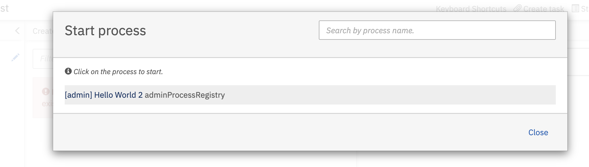

# camunda-admin-process-registry

Run administration tasks directly from the camunda 7 cockpit using generated mini-processes.

[](https://github.com/holisticon#open-source-lifecycle)
[](https://github.com/holunda-io/camunda-admin-process-registry/actions)
[](https://holisticon.de/)
[](https://maven-badges.herokuapp.com/maven-central/io.holunda/camunda-admin-process-registry)


This lib/spring-boot-auto-config allows you to easily and fast generate and deploy single-service-task processes that can e started from the camunda-webapp/tasklist.

Doing so enables you to implement administration/house-keeping jobs as a process, use camundas form/ui and run tasks controlled with the full power of the engine cockpit, including error handling and analysis.

## How does it work

Once you included the lib in your camunda spring boot application, create an [AdminProcess](src/main/kotlin/io/holunda/camunda/platform/adminprocess/AdminProcess.kt) bean like this:  

```kotlin

  @Bean
  fun helloWorldAdminProcess(): AdminProcess {
    val foo = StringField("foo", "Foo - enter your name")
    val date = DateField("date", "Date - select some magic")

    return adminProcess(
      activityId = "helloWorld",
      label = "Hello World 2",
      formFields = listOf(foo, date)
    ) {
      val variables = CamundaBpmData.reader(it)

      logger.info { """ Hi, I am the process running with:
          * foo: ${variables.get(foo)}
          * date: ${variables.get(date)}
        """.trimIndent()
      }
    }
  }
  
```

And you are done!

---

The generated model looks like this:


You can run the process in the webapp: 



And fill out the form:


